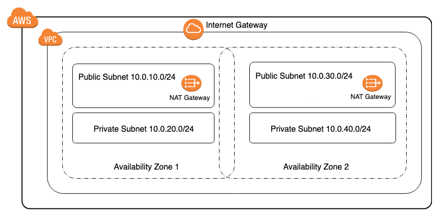

# aws-2-zone-vpc-cf-template

## Description:

This <a href="https://aws.amazon.com/cloudformation/" target="_blank">AWS CloudFormation</a> solution creates a <a href="https://aws.amazon.com/vpc" target="_blank"> AWS VPC</a> with 2 public subnets and 2 private subnets leveraging two availbility zones. All appropriate outbound routing for public subnets use an AWS Internet Gateway and private subnets use a AWS NAT Gateway. For security and compliance ensuring your resources are appropriately separated between public and private network environments and spread across multiple AWS availability zones is a necessity.

AWS CloudFormation provides a common language for you to describe and provision all the infrastructure resources in your cloud environment.

Amazon Virtual Private Cloud (Amazon VPC) lets you provision a logically isolated section of the AWS Cloud where you can launch AWS resources in a virtual network that you define.

## AWS Resource Costs

As with most AWS services you will incur costs for usage. For this CloudFormation template the resources that incur costs are as follows.

* Pricing:

   * <a href="https://aws.amazon.com/vpc/pricing" target="_blank">NAT Gateway pricing</a> resource used in example: *2 Nat Gateway's*
   * <a href="https://aws.amazon.com/ec2/pricing/on-demand/" target="_blank">Elastic IP pricing</a> resource used in example: *2 Elastic IP's*

## Prerequisites

* <a href="https://aws.amazon.com" target="_blank"> Amazon Web Services Account</a>
* <a href="https://aws.amazon.com/iam/" target="_blank">IAM</a> user with the following permissions:
   * AWSCloudFormationReadOnlyAccess
   * AmazonVPCFullAccess
   * AmazonEC2FullAccess

## CloudFormation Template

* The CloudFormation Template is available on GitHub:
   * <a href="https://github.com/getcft/aws-2-zone-vpc-cf-template" target="_blank">aws-2-zone-vpc-cf-template</a>

## Deploy the CloudFormation Template

* AWS Management Console

   * Login to *AWS Management Console*
   * Launch under *CloudFormation* your *2-zone-vpc-cf-template.yml* (included in this repo)

* CloudFormation Fields:

   * *Stack name* (Enter a name to associate to your AWS VPC deployment)
   * *Environment Name* (Name to describe the VPC environment) *Next*
   * Continue choosing *Next*
   * Click *Create* (This will take a few minutes for resources to be created)

## Results of the CloudFormation Template

In the *AWS Management Console* you should be able to verify the following have been created.

* Resources Created:
   * 1 Public Subnet 10.0.10.0/24 (in Zone A, with 254 usable IP's)
   * 1 Private Subnet 10.0.20.0/24 (in Zone A, with 254 usable IP's)
   * 1 Public Subnet 10.0.30.0/24 (in Zone B, with 254 usable IP's)
   * 1 Private Subnet 10.0.40.0/24 (in Zone B, with 254 usable IP's)
   * 5 Route table entries to route traffic either within 10.0.0.0/16 or to the either the Internet Gateway or NAT Gateway for outbound
   * 1 Internet Gateway (for all outbound traffic)
   * 2 NAT Gateways (for outbound traffic from private zone A and B)
   * 2 Elastic IP addresses (associated to respective NAT Gateway's)
